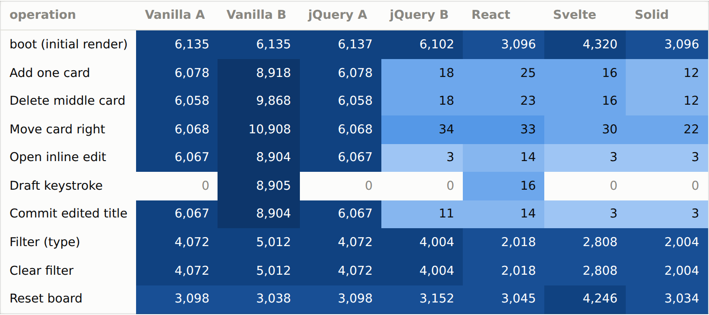
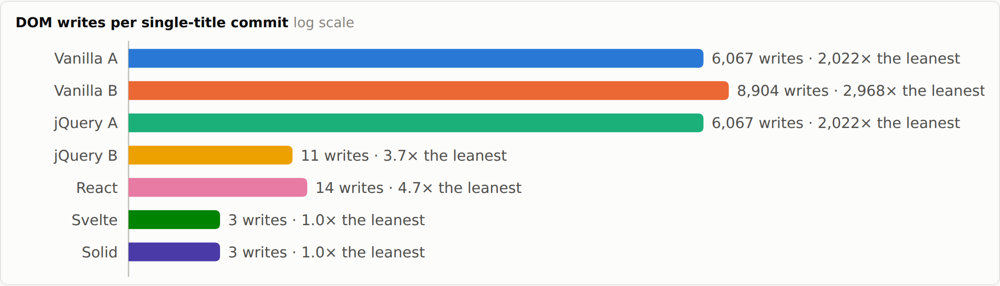
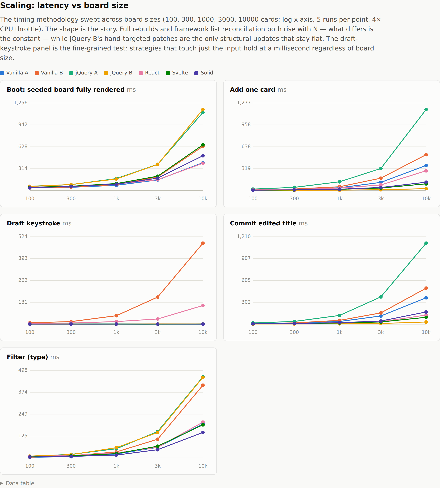
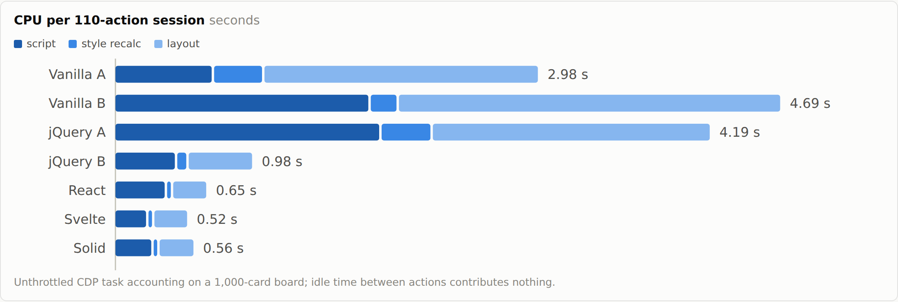
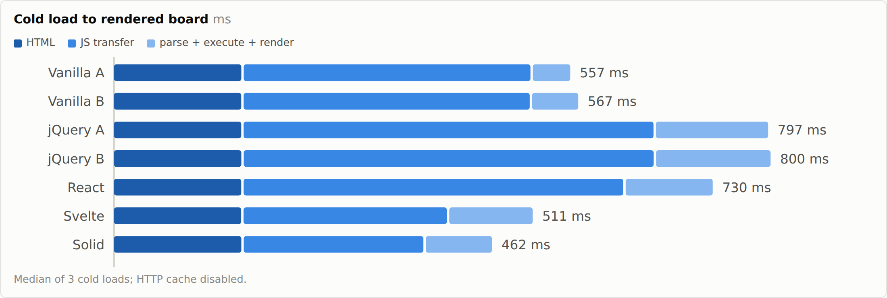
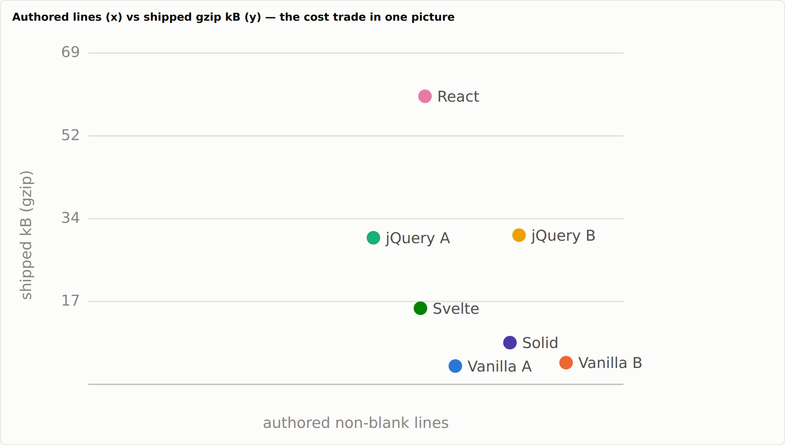

# JSFrameworks

This repo is a learning lab for comparing JavaScript UI approaches by building the same small app several ways.

The app is **Tiny Kanban**: a minimal Trello-like board with Todo, Doing, and Done columns. Each implementation must match the same behavior contract in [SPEC.md](./SPEC.md) while using the idioms of its own approach. The point is not to translate identical code seven times; it is to see where each style puts state, rendering, identity, events, and side effects.

## Implementations

`00-compare-all/` is the **Implementation Comparison Harness**. It is not an eighth
implementation; it is a lightweight Vite page that shows the seven real implementations side by side.

1. `01-vanilla-a-rerender/` - Vanilla JavaScript with a simple render loop.
2. `02-vanilla-b-keyed-patch/` - Vanilla JavaScript with keyed DOM reuse for identity and focus.
3. `03-jquery-a-render-loop/` - jQuery used to shorten DOM creation while keeping a render loop.
4. `04-jquery-b-incremental/` - jQuery with direct incremental DOM patches.
5. `05-react/` - React 19 app built with Vite.
6. `06-svelte/` - Svelte 5 app using runes, built with Vite.
7. `07-solid/` - SolidJS app using stores and fine-grained reactivity, built with Vite.

Shared CSS, seed/persistence helpers, and framework-neutral state transitions live in `shared/`.

## What Stays The Same

Every implementation follows the same app-visible state shape:

```js
{
  columns: {
    todo: [{ id, title }],
    doing: [{ id, title }],
    done: [{ id, title }]
  },
  filter: "",
  editing: null // or { columnId, cardId, draftTitle }
}
```

The shared behavior contract is:

- Add, delete, move, and inline-edit cards.
- Filter cards by title, case-insensitively.
- Persist only durable board data: `columns`.
- Reset clears storage and restores seed data.
- Treat card titles as plain text, never HTML.
- Empty adds do nothing.
- Empty edit commits cancel editing and preserve the original title.

## Tooling

Current pinned references:

- Node `26.3.0`
- npm `11.16.0`
- jQuery `4.0.0`
- React / React DOM `19.2.8`
- Svelte `5.56.8`
- Solid (`solid-js`) `1.9.14`
- Vite `8.1.5`
- Biome `2.5.5`

Use **npm** for package management and scripts. This is intentional: the project uses good old
Node and npm instead of flashier alternatives so the reference implementation stays boring,
idiomatic, and easy to recognize. The repo pins Node with `.node-version`, pins npm with
`packageManager`, and uses exact package versions through `.npmrc`. Each package boundary owns its
own `package-lock.json`.

There is a root package only for shared Biome tooling; it is not a workspace. Install dependencies
inside each package boundary:

```sh
npm install
npm --prefix 00-compare-all install
npm --prefix 05-react install
npm --prefix 06-svelte install
npm --prefix 07-solid install
```

Use `npx` only for one-off tools that are not already represented by project scripts. Do not add
lockfiles or commands for other package managers.

## Running The Apps

All implementations side by side:

```sh
npm run dev:compare
```

The comparison harness exists to make the end-user experience visible across implementations. At
the end of the day, users do not care whether a board came from vanilla JavaScript, jQuery, React,
or Svelte; they care that the interaction is good. The implementation path still matters for
maintainability and future changes, but the harness keeps the user experience comparison honest.

Static implementations:

```sh
python3 -m http.server
```

Then open one of:

- `http://127.0.0.1:8000/01-vanilla-a-rerender/`
- `http://127.0.0.1:8000/02-vanilla-b-keyed-patch/`
- `http://127.0.0.1:8000/03-jquery-a-render-loop/`
- `http://127.0.0.1:8000/04-jquery-b-incremental/`

Stick to `127.0.0.1` or `localhost`: card IDs come from `crypto.randomUUID()`, which only
exists in secure contexts, so a LAN-IP origin cannot add cards.

React:

```sh
npm run dev:react
```

Svelte:

```sh
npm run dev:svelte
```

Solid:

```sh
npm run dev:solid
```

## Quality Checks

Central Biome commands run from the repo root:

```sh
npm run check
npm run check:write
npm run lint
npm run format
```

Build the standalone framework apps from the root:

```sh
npm run build
npm run build:react
npm run build:svelte
npm run build:solid
```

The bench conformance suite verifies the behavioral contract: it drives the SPEC.md
acceptance checklist through a real browser against every implementation. For quick manual
checks, focus on add, delete, move, edit commit/cancel, filter, reset, persistence,
empty-title behavior, and the XSS text case from the spec.

## Benchmarks

`bench/` measures all seven implementations apples to apples - same app, same markup, so the
differences are the rendering strategies themselves:

```sh
npm --prefix bench install
npm run bench
```

The default run measures four things. A MutationObserver ledger counts every DOM write each
strategy issues per user action, and derives a write-amplification factor for a single title
edit. Latency runs against 1,000-card production builds under CPU throttle: per-interaction
medians, a script/style/layout CPU breakdown for a fixed editing session, and cold-start
segments under Fast-3G emulation. Payload gets weighed both ways - bytes shipped against
lines authored, with bundle composition attributed by sourcemap. And the SPEC.md acceptance
checklist runs as a browser-driven conformance matrix, alongside memory and listener counts.

`npm run bench:scaling` is a separate, slow opt-in that sweeps latency across
100-10,000-card boards to produce the latency-vs-board-size curves. Results land in
`bench/results/`, and the self-contained report is written to `bench/report/index.html`.
Methodology is in [bench/README.md](./bench/README.md).

### Results at a glance

Exported from the committed reference run (one machine; regenerate with `npm run bench`).
The [full report](./bench/report/index.html) adds hover breakdowns and a data table under
every chart.

<picture>
  <source media="(prefers-color-scheme: dark)" srcset="./bench/report/media/write-ledger-dark.png">
  
</picture>

*DOM writes per user action on a 300-card board. A single-card change costs the render-loop
rungs ~6,000 writes and the diffing or fine-grained rungs 3 to 34. Vanilla B is the twist:
keyed reuse fixes focus but still re-stamps every attribute on every keystroke.*

<picture>
  <source media="(prefers-color-scheme: dark)" srcset="./bench/report/media/amplification-dark.png">
  
</picture>

*Write amplification, log scale: one committed title costs Svelte and Solid 3 DOM writes,
and the render-loop rungs thousands.*

<picture>
  <source media="(prefers-color-scheme: dark)" srcset="./bench/report/media/scaling-dark.png">
  
</picture>

*Latency vs board size (log x). jQuery B's hand-targeted patches are the only structural
updates that stay flat; framework reconciliation grows with N at a much smaller constant
than full rebuilds; draft keystrokes hold at ~1 ms everywhere except React and vanilla B.*

<picture>
  <source media="(prefers-color-scheme: dark)" srcset="./bench/report/media/workday-dark.png">
  
</picture>

*The same 110-action editing session on every rung: rebuild strategies pay in layout,
reconciliation pays in script, and the targeted-update rungs barely pay at all.*

<picture>
  <source media="(prefers-color-scheme: dark)" srcset="./bench/report/media/coldstart-dark.png">
  
</picture>

*Cold start on emulated Fast 3G. Shipped bytes become felt time - and the jQuery rungs'
two-request waterfall costs more transfer time than React's single 62 kB bundle.*

<picture>
  <source media="(prefers-color-scheme: dark)" srcset="./bench/report/media/author-vs-user-dark.png">
  
</picture>

*Author cost vs user cost: what you write against what your users download.*

## Learning Focus

Use the implementations to compare:

- Where truth lives: state object, DOM, component state, compiler-tracked state, or a signal-backed store.
- What updates the UI: full render, manual patches, reconciliation, or fine-grained reactivity.
- How identity bugs are prevented: `data-card-id`, React `key`, Svelte keyed `{#each}`, or Solid `<For>` reference identity.
- Where side effects belong: ad hoc handlers, `useEffect`, `$effect`, or `createEffect`.
- What each approach costs in discipline, boilerplate, or framework concepts.

Current implementation shape:

- Vanilla A and jQuery A keep structural updates as render-loop examples; draft typing updates state without repainting the input on every keystroke.
- Vanilla B preserves keyed DOM nodes by `data-card-id`.
- jQuery B patches the specific DOM nodes each action affects.
- React keeps board transitions in a reducer and persists durable columns in an effect.
- Svelte keeps board state in a module-level rune, mutates the deep `$state` proxy through intent-named actions, and uses bindings for editable input state.
- Solid keeps board state in one store, expresses transitions with path setters and `produce`, and persists columns from a single deferred `createEffect`.

Keep visible behavior aligned across rungs. UI-specific code belongs in the numbered implementation folders; shared state transitions belong in `shared/actions.js` and seed/persistence helpers in `shared/seed.js`. The Svelte and Solid rungs express their transitions natively (deep proxy mutation and store primitives, see SPEC.md) while reusing the shared read and persistence helpers.
